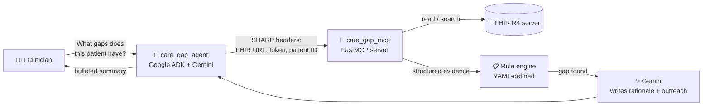

<div align="center">

# 🩺 Care Gap Closer

**An open-source MCP server + A2A agent that finds overdue preventive care in a patient's FHIR record — and writes the outreach to close it.**

[](LICENSE)
[](#-quick-start)
[](https://hl7.org/fhir/R4/)
[](https://gofastmcp.com/)
[](https://a2aproject.github.io/A2A/)

[Quick Start](#-quick-start) · [Architecture](#-architecture) · [Tools](#-tools) · [Care Gaps](#-care-gaps-implemented) · [Make It Yours](#-make-it-yours) · [FAQ](#-faq--troubleshooting)

⭐ **If this is useful, star it — it helps other people building on FHIR + MCP find it.**

</div>

---

## See it in action

Ask it about a real (public, synthetic) patient and it comes back with this:

> **You:** *What preventive care gaps does this patient have?*
>
> **Agent:**
> Here's what I found for Danae Kshlerin (61F):
> - **HbA1c overdue** — last A1c was 65.8 months ago (Nov 2020). *Patient has long-standing type 2 diabetes; over 5 years without monitoring puts her at high risk for unrecognized glycemic deterioration.*
> - **Colorectal screening overdue** — no record on file.
> - **Mammography overdue** — no record on file.
>
> Want me to draft outreach for any of these?
>
> **You:** *Draft an SMS about the A1c.*
>
> **Agent:**
> *"Hi Danae — your last A1c blood test was a while back. A quick check-in helps us keep your diabetes on track. Call us at the clinic when you can, and we'll find a time that works."*

The first message came from a **deterministic rule engine** reading real FHIR data — it can't hallucinate a gap. The second came from **Gemini**, which only ever writes about a gap that already exists. That split is the whole idea — see [Why this architecture](#why-split-rules-from-the-llm).

Try it yourself in the next 2 minutes 👇

---

## 🚀 Quick Start

Zero portal signup required — this runs entirely on your machine against a public FHIR sandbox.

<details open>
<summary><b>Prerequisites</b></summary>

- Python 3.11+ (3.13 for the MCP server, 3.11 for the agent — see `.python-version` in each folder)
- A free [Google AI Studio](https://aistudio.google.com/apikey) API key (`GOOGLE_API_KEY`)
- [`uv`](https://docs.astral.sh/uv/) (recommended for the MCP server) or plain `pip`

</details>

<details open>
<summary><b>1. Start the MCP server</b> (Terminal 1)</summary>

```bash
cd care_gap_mcp
uv sync
GOOGLE_API_KEY=your-key MCP_PORT=9000 uv run python main.py
```

You should see:
```
Starting Care Gap Closer MCP at http://127.0.0.1:9000/mcp
```

</details>

<details open>
<summary><b>2. Start the A2A agent</b> (Terminal 2)</summary>

```bash
cd care_gap_agent
python -m venv .venv && source .venv/bin/activate
pip install -r requirements.txt
cp .env.example .env   # fill in GOOGLE_API_KEY + API_KEY_PRIMARY
uvicorn care_gap_agent.app:a2a_app --host 0.0.0.0 --port 8001
```

</details>

<details open>
<summary><b>3. Ask it a real question</b> (Terminal 3)</summary>

```bash
cd care_gap_agent
./scripts/test_care_gap_agent.sh
```

This drives the exact conversation shown above, end-to-end — agent → MCP → FHIR — against the [SMART Health IT public Synthea sandbox](https://r4.smarthealthit.org). No accounts, no API keys beyond your own Gemini key, no fake data — it's a real, if synthetic, patient record.

Point it at a different patient or FHIR server:
```bash
API_KEY=demo-key FHIR_URL=https://r4.smarthealthit.org PATIENT_ID=<id> ./scripts/test_care_gap_agent.sh
```

</details>

<details>
<summary><b>4. (Optional) Register with the Prompt Opinion marketplace</b></summary>

This project originated as an Agents Assemble hackathon submission and ships with first-class support for the [Prompt Opinion](https://app.promptopinion.ai) agent marketplace — but nothing above requires it.

```bash
ngrok http 8001    # tunnel for the agent
ngrok http 9000    # tunnel for the MCP server (separate ngrok session)
```

Then in the Prompt Opinion portal:
1. **Register the MCP server** — paste the MCP ngrok URL + `/mcp`.
2. **Register the A2A agent** — paste the agent ngrok URL; PO auto-discovers `/.well-known/agent-card.json`.
3. **Provide `API_KEY_PRIMARY`** as the `X-API-Key` value.
4. **Connect a workspace FHIR source**, open a patient, and ask the agent.

</details>

---

## 🏗️ Architecture



<details>
<summary><b>Full component diagram</b> (services, headers, tool list)</summary>

```
Prompt Opinion portal (cloud, optional)
      │  A2A JSON-RPC + FHIR metadata (per A2A v1 + PO extension URI)
      ▼  ngrok tunnel → :8001
┌────────────────────────────────────────────────────────────────┐
│  care_gap_agent  (Google ADK · Gemini · A2A v1)                 │
│   • shared.middleware bridges metadata → params.metadata        │
│   • shared.fhir_hook extracts FHIR context into session state   │
│   • 6 ADK tools, each forwards FHIR context as SHARP headers    │
└─────────────────────────┬───────────────────────────────────────┘
                          │  HTTP (SHARP-on-MCP)
                          │   X-FHIR-Server-URL
                          │   X-FHIR-Access-Token
                          │   X-Patient-ID
                          ▼
┌────────────────────────────────────────────────────────────────┐
│  care_gap_mcp  (FastMCP · POFastMCP · ai.promptopinion/fhir-context)│
│   • SummarizePatient        ─┐                                  │
│   • ListActiveConditions     │ deterministic FHIR queries       │
│   • ListRecentObservations  ─┘                                  │
│   • FindCareGaps             rule engine + Gemini rationale     │
│   • GetPatientRiskSummary    severity rollup + risk level       │
│   • DraftOutreachMessage     Gemini patient-language outreach   │
└─────────────────────────┬───────────────────────────────────────┘
                          │
                          ▼
                   FHIR R4 server
              (SMART Health IT sandbox or any
               PO-bridged EHR FHIR endpoint)
```

</details>

<details>
<summary><b>How does a patient's FHIR context reach the MCP server?</b></summary>

1. The A2A caller includes `fhir-context` metadata on the message: `fhirUrl`, `fhirToken`, `patientId`.
2. `care_gap_agent/shared/middleware.py` bridges that metadata into `params.metadata`.
3. `care_gap_agent/shared/fhir_hook.py` runs as an ADK `before_model_callback`, extracting it into session state.
4. `care_gap_agent/shared/tools/care_gap.py` reads session state and forwards it as `X-FHIR-Server-URL` / `X-FHIR-Access-Token` / `X-Patient-ID` headers on every MCP call.
5. `care_gap_mcp/po_fastmcp/fhir_context.py` reads those headers server-side and hands a `FhirContext` to whichever tool is running.

**The agent never sees a FHIR token in a prompt.** Credentials travel as HTTP headers and session state — never as text an LLM reads.

</details>

### Why split rules from the LLM?

Rule engines have flagged "patient overdue for a screening" for decades. What they've never done is write the **patient-specific clinical rationale** a care manager would use, or the **plain-language outreach** a patient would actually read.

| | Job | Owner |
|---|---|---|
| 🧮 | Decide **what's overdue** — deterministic, evidence-grounded | Rule engine (YAML) |
| ✍️ | Decide **how to explain it** — clinical rationale + patient copy | Gemini (LLM) |

The rule engine is the single source of truth for what counts as a gap. The LLM is only ever asked to *write about* a gap that already exists — it can't invent one, and if Gemini is unreachable, every gap falls back to a clinician-authored template instead of silently failing.

---

## 🔧 Tools

| Tool | What it does | Uses an LLM? |
|---|---|:---:|
| `SummarizePatient` | Demographics + computed age | — |
| `ListActiveConditions` | Active problem list (SNOMED + ICD-10) | — |
| `ListRecentObservations` | Recent labs, vitals, and screening procedures | — |
| `FindCareGaps` | Rule engine flags overdue screenings/vaccines; Gemini writes the one-sentence clinical rationale | ✨ |
| `GetPatientRiskSummary` | Fast severity rollup (`risk_level` + counts) — skips per-gap rationale for speed | — |
| `DraftOutreachMessage` | Gemini drafts SMS/portal copy for a specific gap, sixth-grade reading level | ✨ |

The agent orchestrates these; it holds no FHIR or authorship logic of its own. See [`care_gap_agent/routing/rules.yaml`](care_gap_agent/routing/rules.yaml) for the full intent → tool-chain mapping.

---

## 📋 Care gaps implemented

<details open>
<summary><b>13 USPSTF/ACIP-aligned rules</b> — click to expand</summary>

| Rule | Trigger |
|---|---|
| `diabetes-a1c-overdue` | active DM (SNOMED 44054006/73211009 or ICD-10 E10/E11/E13) + no LOINC 4548-4 in 6mo |
| `hypertension-bp-overdue` | active HTN (SNOMED 38341003 or ICD-10 I10–I15) + no LOINC 8480-6 in 12mo |
| `colorectal-screening-overdue` | age 45–75 + no CPT 45378/45380/45385 in 10y / 82270 in 1y |
| `mammography-overdue` | female, age 40–74 + no CPT 77065/77066/77067 in 24mo |
| `cervical-screening-overdue` | female, age 21–65 + no CPT 88142/88150/88164 in 3y / 87624 in 5y |
| `lipid-panel-overdue` | age 40+ + no LOINC 2093-3/13457-7/57698-3 in 5y |
| `lung-cancer-screening-overdue` | tobacco use (SNOMED) + age 50–80 + no CPT 71271 in 1y |
| `osteoporosis-screening-overdue` | female, age 65+ + no CPT 77080 in 24mo |
| `depression-screening-overdue` | age 18+ + no LOINC 44249-1 (PHQ-9) in 12mo |
| `influenza-vaccine-overdue` | age 18+ + no CVX 88/141/150/158 in 12mo |
| `tdap-vaccine-overdue` | age 18+ + no CVX 115/07 in 10y |
| `pneumococcal-vaccine-overdue` | age 65+ + no CVX 33/133/215 ever |
| `shingles-vaccine-overdue` | age 50+ + no CVX 187 ever |

</details>

**Adding a new rule usually means editing YAML, not Python.** If your rule fits one of the existing threshold shapes — `observation`, `procedure`, `procedure_any`, or `immunization` — just add an entry to [`care_gap_mcp/knowledge_base/care_gap_rules.yaml`](care_gap_mcp/knowledge_base/care_gap_rules.yaml) and any new codes to [`terminology.yaml`](care_gap_mcp/knowledge_base/terminology.yaml). No code changes, no redeploy of logic — just data.

---

## 🛠️ Make it yours

This repo is deliberately built so the parts you'd want to change are data and config, not code:

- **Swap the rule set** — replace `care_gap_rules.yaml` with your own compliance program (HEDIS, a payer contract, an internal protocol). The engine doesn't know or care what USPSTF is.
- **Point at your own FHIR server** — anything speaking SMART-on-FHIR R4 works; the sandbox is just the default.
- **Change the tone or channel** — outreach copy lives in Markdown prompts (`care_gap_mcp/prompts/*.md`), editable without touching Python.
- **Swap the LLM** — the agent runs on [LiteLLM](https://github.com/BerriAI/litellm), so `CARE_GAP_AGENT_MODEL` can point at OpenAI, Anthropic, or Vertex AI instead of Gemini with no code change.
- **Add a new tool or gap type** — see the [FAQ](#-faq--troubleshooting) below for the exact files to touch.

If you build something on top of this, [open a PR](../../pulls) or [an issue](../../issues) describing it — happy to link out to forks and adaptations here.

---

## 🌐 Standards used

| Standard | How it's used |
|---|---|
| **MCP** | [FastMCP](https://gofastmcp.com/), exposes 6 tools over Streamable HTTP |
| **SHARP-on-MCP** | `ai.promptopinion/fhir-context` capability extension declares required SMART scopes; FHIR context arrives as headers |
| **A2A v1** | Agent card with `supportedInterfaces`, `apiKeySecurityScheme`, FHIR extension via `params.scopes` |
| **FHIR R4** | Patient, Condition, Observation, Procedure, Immunization — via the [SMART Health IT public Synthea sandbox](https://r4.smarthealthit.org) |

---

## ☁️ Deploying

Both services deploy independently via [`render.yaml`](render.yaml) as a [Render Blueprint](https://render.com/docs/blueprint-spec):

1. Push this repo to GitHub and create a new Blueprint on Render pointing at it.
2. Render provisions `care-gap-mcp` and `care-gap-agent` as separate web services on the `starter` plan (no cold starts — important if you plan to register this on a marketplace where a stranger's first request needs to just work). Drop to `plan: free` in `render.yaml` if you're only running a personal/demo deployment and don't mind ~30s cold starts.
3. Set `GOOGLE_API_KEY` (both services) and `API_KEY_PRIMARY` (agent only) in the Render dashboard — these are marked `sync: false` and won't be picked up from the repo.
4. **Deploy the MCP service first.** Once it's live, copy its URL + `/mcp` into the agent's `MCP_SERVER_URL` environment variable and redeploy the agent.
5. **Serving more than one integration/workspace?** Set `API_KEYS` (comma-separated) instead of relying only on `API_KEY_PRIMARY`, and issue each integration its own key — see `care_gap_agent/.env.example`.

---

## ❓ FAQ / Troubleshooting

<details>
<summary><b>The agent says "FHIR context not available"</b></summary>

The caller must include a `fhir-context` extension in the A2A message metadata with `fhirUrl`, `fhirToken`, and `patientId`. If you're testing via the smoke-test script, check that `FHIR_URL` and `PATIENT_ID` are set correctly.

</details>

<details>
<summary><b>FindCareGaps returns gaps with no rationale, or a fallback-looking sentence</b></summary>

That's the designed fallback — if `GOOGLE_API_KEY` is missing or the Gemini call fails, each gap falls back to its `rationale_template` from `care_gap_rules.yaml` instead of an LLM-authored sentence. Check the server logs for the underlying error, and confirm `GOOGLE_API_KEY` is set on the **MCP server** (not just the agent).

</details>

<details>
<summary><b>GET requests to <code>/mcp</code> return HTTP 406</b></summary>

That's expected — FastMCP's Streamable HTTP transport only responds to properly-negotiated MCP client requests, not plain browser `GET`. Liveness is "the process is listening on the port," not an HTTP 200 on GET. Don't wire a health check to this endpoint.

</details>

<details>
<summary><b>How do I add a new preventive-care rule?</b></summary>

1. Check the four supported threshold shapes in `care_gap_mcp/tools/care_gaps.py` (`observation`, `procedure`, `procedure_any`, `immunization`).
2. Add any new codes to `care_gap_mcp/knowledge_base/terminology.yaml`.
3. Add the rule to `care_gap_mcp/knowledge_base/care_gap_rules.yaml`.
4. Restart the MCP server — no other code changes needed.

If your rule needs a genuinely new trigger/threshold shape (e.g. medication adherence), that requires a small addition to `_build_evidence` in `care_gap_mcp/tools/care_gaps.py`.

</details>

<details>
<summary><b>How do I add a new agent tool or intent?</b></summary>

Three layers, in order:
1. **MCP tool** — implement in `care_gap_mcp/tools/`, register in `care_gap_mcp/tools/__init__.py`.
2. **Agent wrapper** — add a proxy function in `care_gap_agent/shared/tools/care_gap.py`, export it from `shared/tools/__init__.py`, and add it to the `tools=[...]` list in `care_gap_agent/care_gap_agent/agent.py`.
3. **Docs** — add the intent to `care_gap_agent/routing/rules.yaml`, update `care_gap_agent/prompts/agent_instruction.md`, and (if it should be marketplace-visible) add it to `care_gap_agent/prompts/skills.yaml`.

</details>

---

## 📦 What's in here

```
Care-Gap-Closer/
├── care_gap_mcp/      # MCP server  — 6 tools, FastMCP + POFastMCP, SHARP headers
│   ├── knowledge_base/    # care_gap_rules.yaml + terminology.yaml (edit rules here, no code)
│   ├── prompts/           # Markdown prompts for rationale + outreach tone
│   └── tools/             # Python tool implementations
├── care_gap_agent/    # A2A agent  — Google ADK + Gemini, calls its own MCP
│   ├── prompts/           # Agent description, instructions, marketplace skills
│   ├── routing/           # Intent → tool-chain mapping (audit trail)
│   └── shared/            # FHIR context bridging, MCP tool wrappers
├── render.yaml        # One-click deploy blueprint for Render.com
└── DEMO_SCRIPT.md     # 3-minute demo video script
```

Each subdirectory has its own README with service-specific setup: [`care_gap_mcp/README.md`](care_gap_mcp/README.md) · [`care_gap_agent/README.md`](care_gap_agent/README.md).

---

## Contributing

Issues and PRs welcome — new rule sets, additional FHIR resource support, other LLM backends, or bug fixes. This started as an Agents Assemble hackathon submission ([demo script](DEMO_SCRIPT.md)); it's maintained as a general-purpose reference for MCP + A2A + FHIR integration.

## 📄 License

[MIT](LICENSE) — do whatever you want with this, including forking it into your own product.
